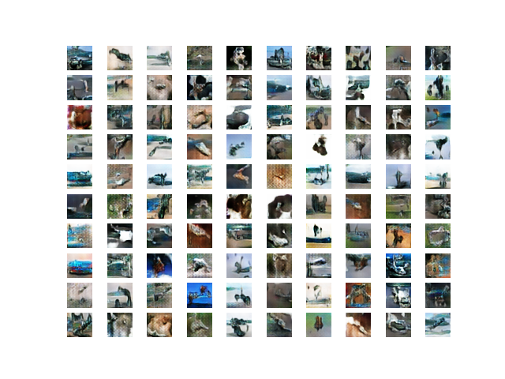
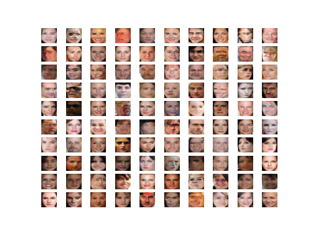

# GANs

Tensorflow implementation of DCGANs \[Generative Adversarial Networks\]. Models trained on GCP with 1 x NVIDIA Tesla T4.

CIFAR-10 and CelebA DCGAN generated images.

## DCGAN on CelebA dataset

#### **\# TODO: Merge with Master**

### Experiments:

* [x] Label Clipping/Label Smoothing
* [x] BatchNorm layers in Generator model
* [ ] Change plotting and integrate Comet ML
* [ ] Streamlit.io 

–––––––––––––––––––––––––––––––––––––––––––––––––––––––––––––––

### To Do:

* [x] MTCNN implementation for "face extraction"
* [x] Create np.savez\_compressed
* [ ] Tf-Gan model abstraction
* [ ] Latent Space _SLERP_ interpolation

## DCGAN on Cifar10

#### kernel initializer = glorot\_normal

### 

